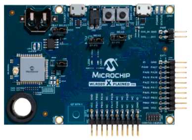
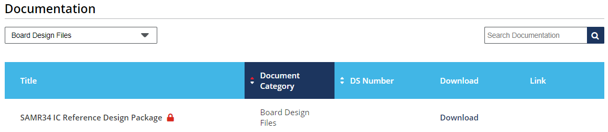
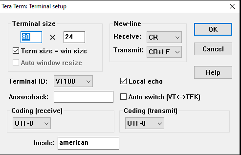
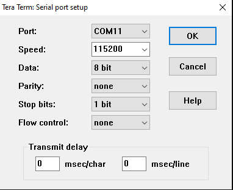
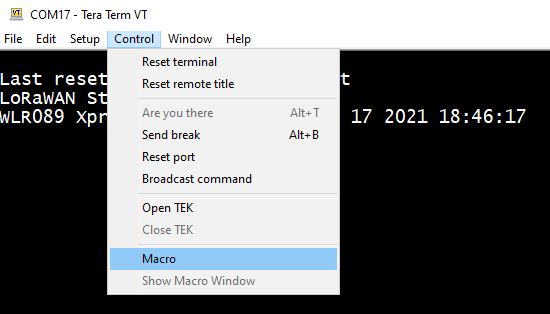
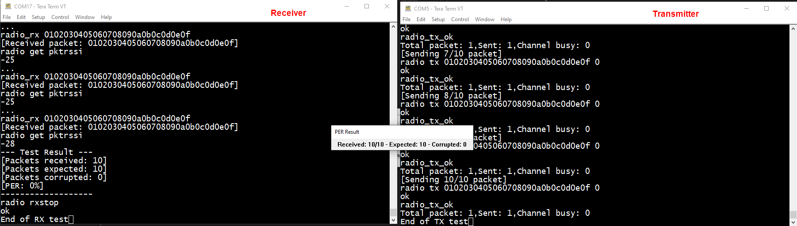
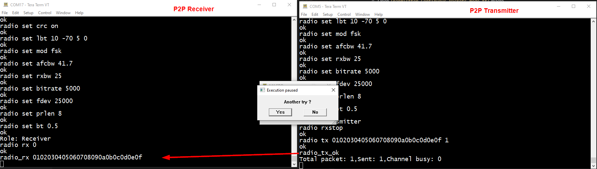

# ATSAMR34_RADIO_TESTING


> "Wireless Made Easy!" - Enable Simple RF Performance Testing of SAM R34 IC and WLR089U0 Module using Reference Design Package Software Tools and Macro files

Devices: | **ATSAMR34 | WLR089U0**

<p align="left">
<a href="https://www.microchip.com" target="_blank">
</a>
<a href="https://www.microchip.com/lora" target="_blank">
</a>
</p>

## ⚠ Disclaimer

<p><span style="color:red"><b>
THE SOFTWARE ARE PROVIDED "AS IS" AND GIVE A PATH FOR SELF-SUPPORT AND SELF-MAINTENANCE.</br></br>
This repository contains unsupported example code intended to help accelerate client product development. It is not validated for production nor audited for security best-practices.</br></br>
Note that while this repository is unsupported, Microchip welcome community contributions, and all pull-requests will be considered for inclusion into the repository.
</span></p></b>

> Interact with peers in the community at [LoRa Forum](https://www.microchip.com/forums/f512.aspx).


## Resources

- [SAMR34/35 and WLR089U Landing page](https://www.microchip.com/design-centers/wireless-connectivity/low-power-wide-area-networks/lora-technology/sam-r34-r35)
- [SAMR34 Device page](https://www.microchip.com/wwwproducts/en/ATSAMR34J18)
- [SAMR34 Xplained Pro Evaluation Kit](https://www.microchip.com/DevelopmentTools/ProductDetails/dm320111)
- [WLR089U0 Module page](https://www.microchip.com/wwwproducts/en/WLR089U0)
- [WLR089U0 Module Xplained Pro Evaluation Kit](https://www.microchip.com/EV23M25A)
- [Microchip Studio 7.0 IDE](https://www.microchip.com/mplab/microchip-studio)

[Clone/Download](https://docs.github.com/en/free-pro-team@latest/github/creating-cloning-and-archiving-repositories/cloning-a-repository) the current repo to get the package.

## A la carte

1. [Introduction](#step1)
1. [Hardware Platforms](#step2)
1. [Software Requirements](#step3)
1. [Prerequisites](#step4)
1. [Sample Tera Term Macros](#step5)
1. [Radio Performance Testing](#step6)
   1. [Continuous Wave Test](#step6a)
   2. [Continuous Packets Transmission Test](#step6b)
   3. [Packet Error Rate Test](#step6c)
   4. [Peer to Peer Test](#step6d)

## Introduction<a name="step1"></a>

This repo provides the basic steps to enable simple RF Performance Testing of SAM R34 IC and WLR089U0 Module using Tera Term Macro Files and the tools included in the Reference Design Package.

Refer to [SAMR34 IC Reference Design Package](https://www.microchip.com/en-us/product/ATSAMR34J18#document-table) to get the full set of documentation and guidelines for performing RF testing and validation. 

> Checkout the [AN1631 - Simple Link Budget Estimation and Performance Measurements](https://ww1.microchip.com/downloads/en/Appnotes/00001631A.pdf) to learn measurement and techniques to evaluate the range and performance of wireless transmission.

## Hardware Platforms<a name="step2"></a>

* Purchase the [SAM R34 Xplained Pro Evaluation Kit](https://www.microchip.com/en-us/development-tool/DM320111)</br></br>


* Purchase the [WLR089U0 Xplained Pro Evaluation Kit](https://www.microchip.com/en-us/development-tool/EV23M25A)</br></br>


* Purchase material to perform RF measurement


## Software Requirements<a name="step3"></a>

* [Microchip Studio 7.0.2542 IDE](https://www.microchip.com/mplab/microchip-studio)

* Download [SAMR34 IC Reference Design Package](https://www.microchip.com/en-us/product/ATSAMR34J18#document-table)

<p align="center">

</p>

* Download [Tera Term](https://ttssh2.osdn.jp/index.html.en)
> Tera Term 4.102 has been tested to validate the Tera Term Macros 

## Prerequisites<a name="step4"></a>

> To enable the SAM R34/R35 or WLR089U0 devices for RF testing, the devices need to be programmed with the device specific SAM R34/R35 or WLR089U0 Radio Utility Firmware Project.

* Using Microchip Studio IDE, compile and program **Radio Utility Program** from the **SAMR34 IC Reference Design Package** into SAM R34 Xpro or WLR089 Xpro

> Checkout the **Radio Utility Commands Reference Manual** to get details on the ASCII-format Radio commands over UART interface.

* Configure Tera Term as following and make sure to enable 'Local echo'

<p align="center">


</p>

* Reset the board and make sure the following message is displayed

```
Last reset cause: External Reset
LoRaWAN Stack UP
WLR089 Xpro MLS_SDK_1_0_P_5 Mar 17 2021 18:46:17
```

## Sample Tera Term Macros<a name="step5"></a>

To enable RF performance testing, several macros are provided in the present repository using the Tera Term language (TTL) to support European and North America bands.

| Macro name | Description |
| ---------- | ----------- |
| FSK_Peer_to_peer | Enable Peer to peer communication using FSK modulation |
| LoRa_Peer_to_peer | Enable Peer to peer communication using LoRa modulation |
| Receiver_Continuous_Rx_mode | Setup a device in continuous receiver mode |
| Receiver_NarrowBand | Setup a device in receiver mode for Packet Error Rate testing |
| Transmitter_Continuous_Packets_mode | Setup a device in transmitter mode for continuous packets mode |
| Transmitter_CW_mode | Enable Continuous wave transmission |
| Transmitter_Packets_mode | Setup a device in transmitter mode for Packet Error Rate testing |

To execute a Tera Term macro, select: **Control -> Macro -> Load .ttl file**
<p align="center">

</p>

## RF Performance Testing<a name="step6"></a>

### Continuous Wave Test<a name="step6a"></a>

- Connect a DUT to Tera Term
  - Open `Transmitter_CW_mode.ttl` macro
  - Select **Output power** index
  - Select the **Frequency** in Hz
  - Set the **Power Amplifier** state
  - Click **Ok** to stop CW test

### Continuous Packet Transmission Test<a name="step6b"></a>

- Connect a DUT #1 to Tera Term
  - Open `Receiver_Continuous_Rx_mode.ttl` macro
  - Select **Output power** index
  - Select the **Frequency** in Hz
  - Set the **Power Amplifier** state
- Connect a DUT #2 to another Tera Term window
  - Open `Tranmistter_Continuous_Packets_mode.ttl` macro
  - Select **Output power** index
  - Select the **Frequency** in Hz
  - Set the **Power Amplifier** state
  - Set the **number of packets to send** continuously

### Packet Error Rate Test<a name="step6c"></a>

- Connect a DUT #1 to Tera Term
  - Open `Receiver_narrowBand.ttl` macro
  - Select **Output power** index
  - Select the **Frequency** in Hz
  - Set the **Power Amplifier** state
  - Set the **number of expected packets** to receive
- Connect a DUT #2 to another Tera Term window
  - Open `Tranmistter_Continuous_Packets_mode.ttl` macro
  - Select **Output power** index
  - Select the **Frequency** in Hz
  - Set the **Power Amplifier** state
  - Set the **number of packets** to be transmitted
  - Set the **delay between consecutive packets** transmission in ms

<p align="center">

</p>

### Peer to Peer<a name="step6d"></a>

- Connect a DUT #1 to Tera Term
  - Open `Peer_to_peer.ttl` macro
  - Select **Receiver role**
- Connect a DUT #2 to another Tera Term window
  - Open `Peer_to_peer.ttl` macro
  - Select **Transmitter role**
  - Hit **Ok** to transmit a packet

<p align="center">

</p>